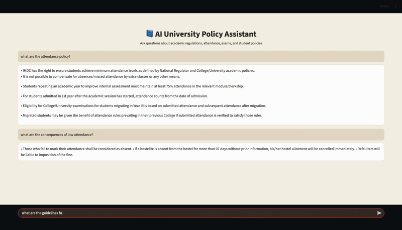

# 📘 AI University Policy Assistant (RAG System)

A Retrieval-Augmented Generation (RAG) based AI assistant that allows users to ask questions from multiple PDF documents and get accurate, context-aware answers using semantic search and Google Gemini LLM.

---

## 🚀 Project Overview

This system acts as an **AI-powered customer support assistant** that can understand and answer questions based on uploaded documents.

It uses:
- Semantic search (not keyword matching)
- Vector similarity (FAISS)
- Large Language Model (Gemini)
- Chat-style interface (Streamlit)

---

## 🧠 How It Works?

PDFs → Text Extraction → Chunking → Embeddings → FAISS Vector Store  
→ User Query → Semantic Search → Top Relevant Chunks → Gemini LLM → Answer

---

## ✨ Features

- 📄 Multi-PDF document support
- 🔍 Semantic search using SentenceTransformers
- ⚡ Fast retrieval using FAISS
- 🤖 AI-generated answers using Gemini
- 💬 Chat-style UI using Streamlit
- 🧠 Context-aware responses

---

## 🛠 Tech Stack

- Python
- Streamlit
- SentenceTransformers
- FAISS
- Google Gemini API

---

## 📂 Project Structure

```
src/
├── app.py
├── llm.py
├── semantic_embedder.py
├── faiss_vector_store.py
├── multi_pdf_loader.py
├── multi_pdf_chunker.py
```

---

## ⚙️ How to Run

### 1. Install dependencies

```bash
pip install -r requirements.txt
```

### 2. Add API key in `.env`

```bash
GEMINI_API_KEY=your_api_key_here
```

### 3. Run the app

```bash
streamlit run src/app.py
```

---

## 📊 What This Project Solves

Traditional keyword search fails to understand meaning.

This system solves that by:

- Understanding semantic meaning of questions  
- Retrieving relevant context from documents  
- Generating natural language answers  

---

## 🧪 Example Use Cases

- Ask about attendance policies  
- Ask about exam rules  
- Search academic regulations  
- Query student handbook content
## 🎥 Demo

